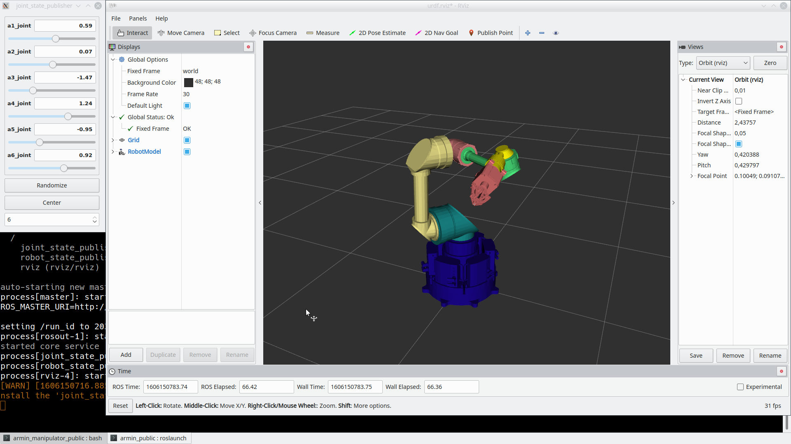
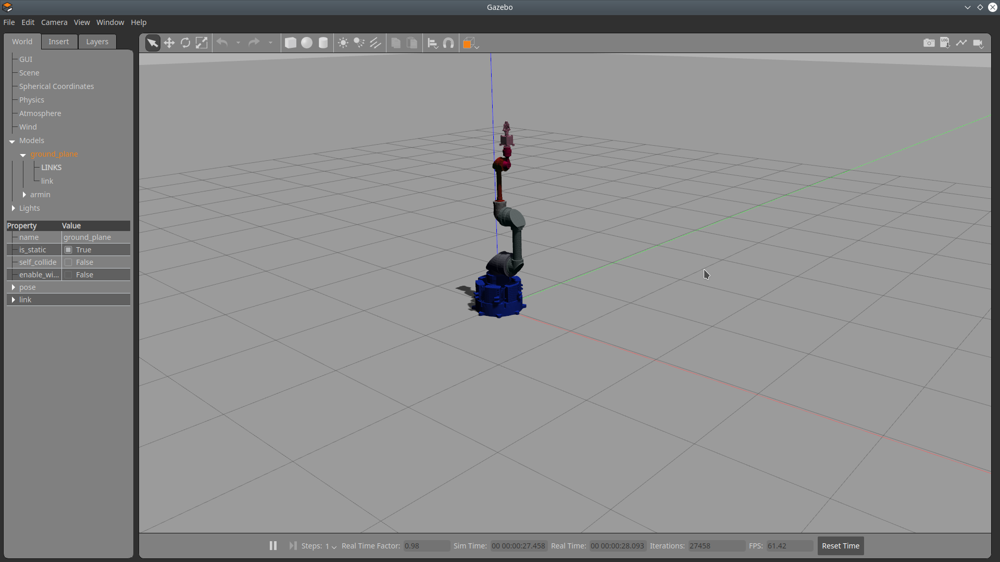
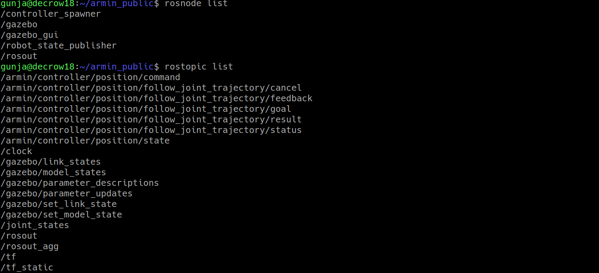
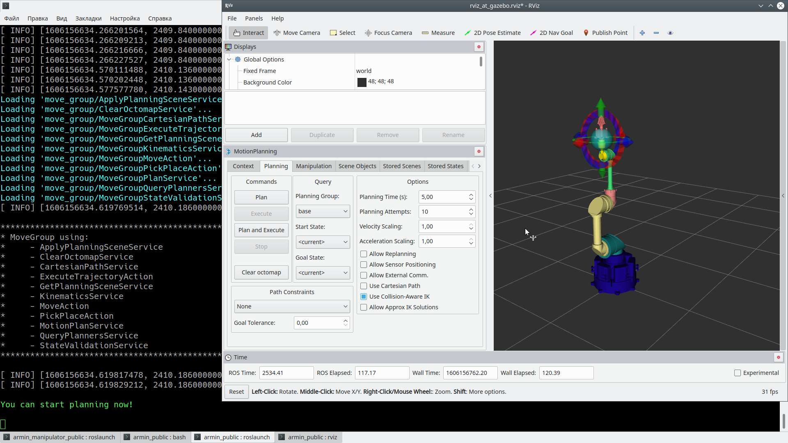
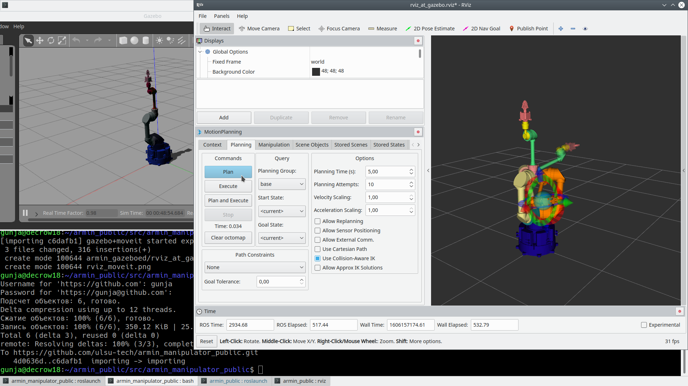
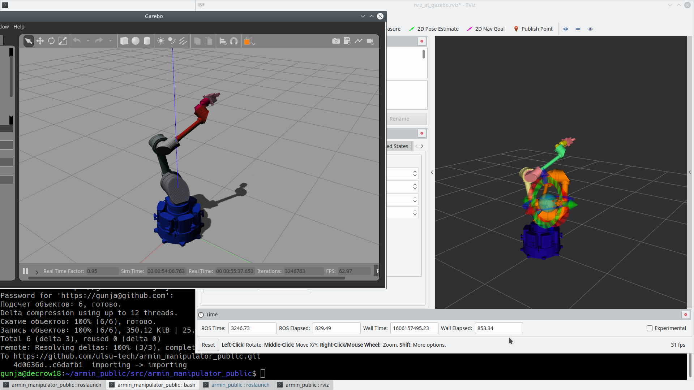
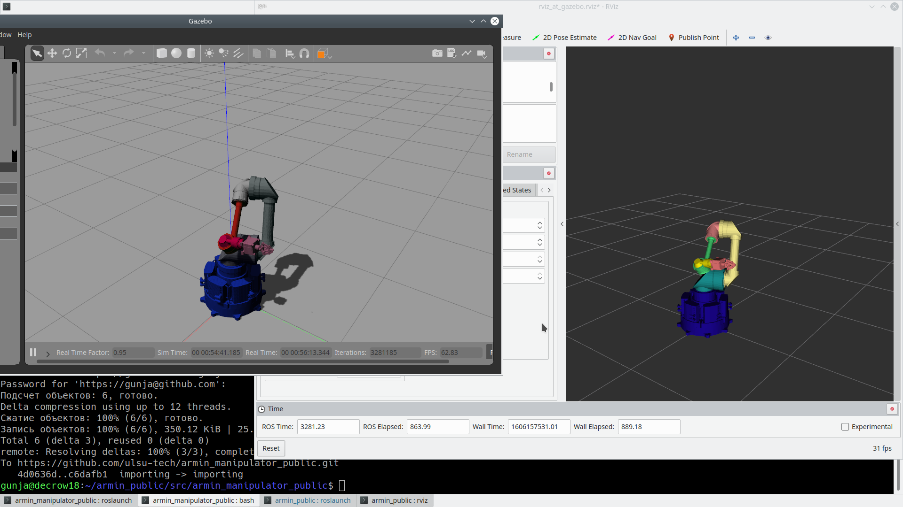
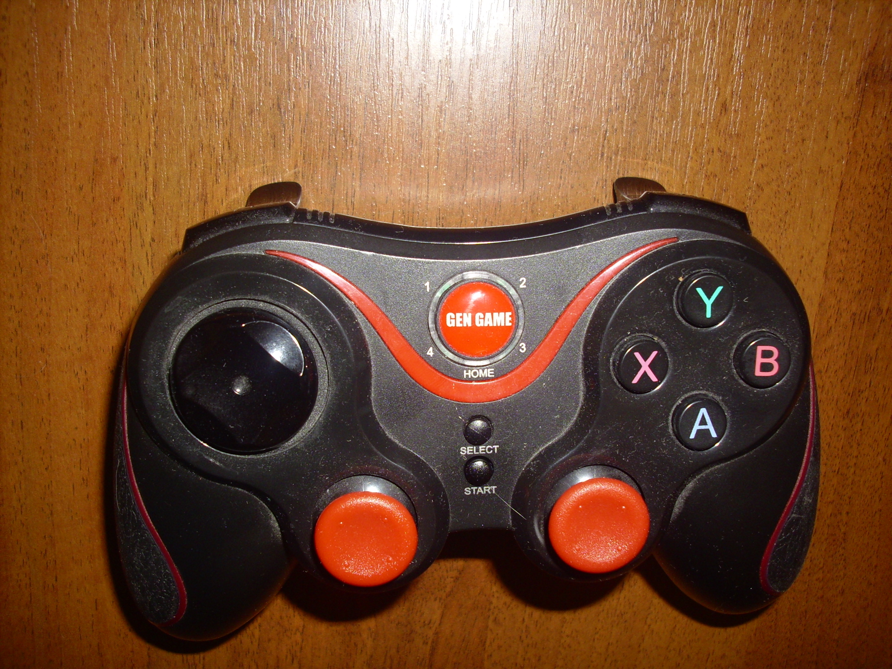
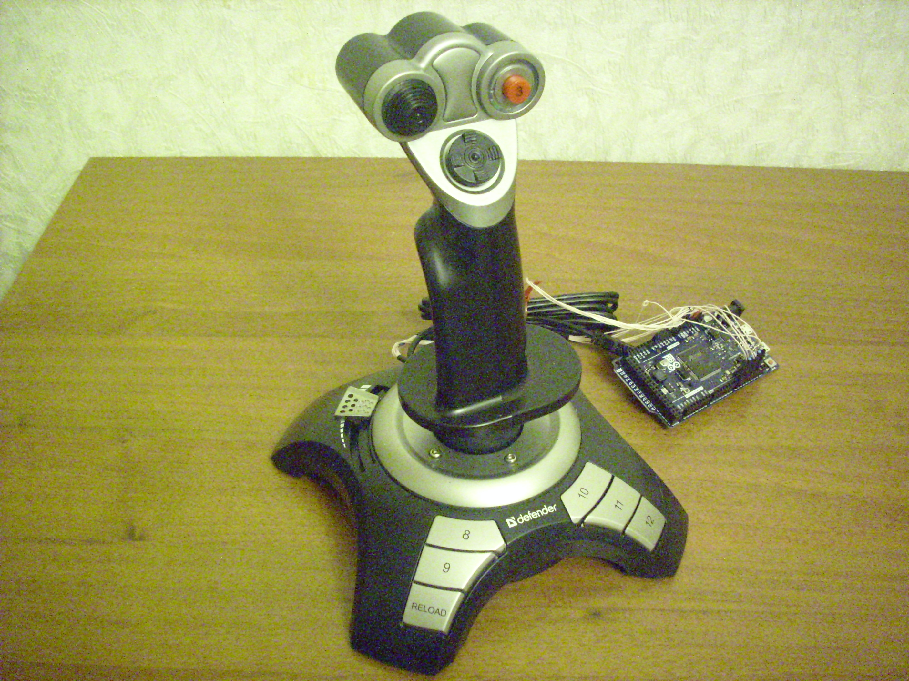
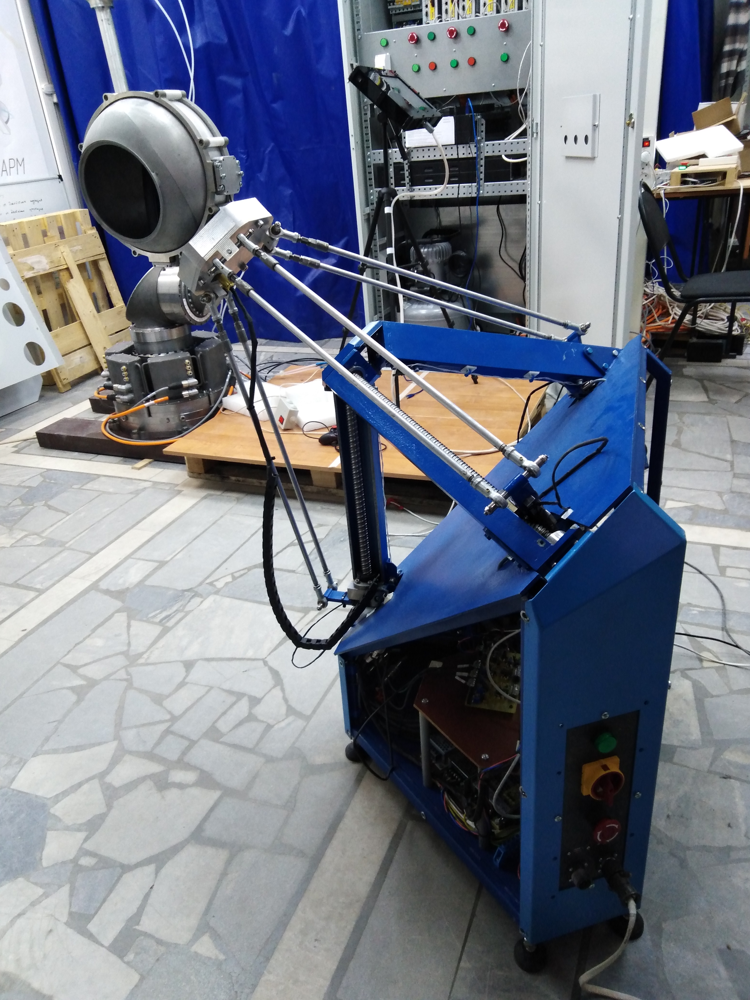

# armin_manipulator_public

This public repo contains model and required ROS-launch files
to let interested people get familiar with solution offered
by S.P. Kapitsa Research Institute of Technology of Ulyanovsk State University.

English version of this file is under development. Russian version is below.

Этот публичный репозиторий содержит ROS-пакеты, необходимые заинтересованным
лицам, для ознакомления с моделью и запуска модели манипулятора в симуляторе Gazebo.

Манипулятор разработан в рамках работы над созданием радиационно-защищённого робото-технического комплекса,
призванного заменить используемые в настоящее время механические копирующие манипуляторы.

В НИТИ им. Капицы УлГУ собран прототип манипулятора. Презентация прототипа доступна по ссылке ниже

  

Версия пакетов проверена на ROS Melodic. Частичная совместимость могла сохраниться с ROS Kinetic.

## Получение актуальной версии
Для запуска команд, описанных ниже, необходимо в вашем рабочем окружении ROS выполнить следующее:

`cd `ROS_WORKSPACE`/src`

`git clone https://github.com/ulsu-tech/armin_manipulator_public.git`

`cd ..`

`catkin_make`

## Содержание репозитория
Этот git репозиторий содержит следующие ROS-пакеты:
- **armin_description** - пакет, содержащий Xacro (URDF) описание манипулятора и launch файлы для загрузки
модели в RViz
- **armin_moveit_config** - пакет, содержащий конфигурацию, необходимую для MoveIt и файлы инициализации параметров на сервере параметров ROS
- **armin_gazeboed** - пакет, содержащий launch файлы и файлы конфигурации, необходимые для запуска манипулятора в симуляторе Gazebo.
- **armin_manipulators** - пакет, содержащий код приложение, используемых для чтения сигналов с источников управления и формирования команд для манипулятора.
- **armin_base_ikfast_ikfast_plugin** - Inverse Kinematic Solver IKFast собранный для группы планирования base (смотрите пакет armin_moveit_config).

## Запуск в RViz (armin_description)
Для просмотра визуальной модели манипулятора и оценки подвижности суставов, достигаемого пространства,
необходимо выполнить:

`roslaunch armin_description display.launch gui:=true`

Установите необходимые пакеты (к примеру joint_state_publisher и joint_state_publisher_gui) если возникают ошибки при запуске.

После запуска этой команды, будут открыты 2 приложения: окно RViz и окно для установки положения узлов манипулятора. Изображение с примерным видом после запуска команды ниже:

Манипулятор содержит 6 степеней свободы, доступных к установке и захват, фиксирующийся в 2х положениях (открыто и закрыто). Изменение захвата доступно только на физической модели и не описано в URDF модели.

## Запуск симулятора Gazebo и управление из RViz через MoveIt плагин (armin_gazeboed, armin_moveit_config, armin_description)
Симуляция манипулятора возможна в пакете Gazebo.
Для загрузки модели в Gazebo и запуска симулированных приводов и сенсоров, необходимо выполнить:

`roslaunch armin_gazeboed armin_world_remap.launch`

Вызов этой команды откроет окно Gazebo с загруженной моделью манипулятора. Примерный вид как на изображении ниже:

При этом менеджер контроллеров загрузил и запустил 2 контроллера:
- /armin/controller/position - контроллер типа FollowJointTrajectory, принимающий на вход траекторию для исполнения, совместимую с генерируемыми MoveIt
- /armin/controller/position/state - контроллер, публикующий состояние узлом манипулятора от симулятора.

Результаты вызовов команд `rosnode list` и `rostopic list` будет похожим на следующий:

### Запуск RViz и командование из MoveIt
Для планирования траектории и передачи их на исполнение в контроллеры Gazebo, необходимо загрузить
параметры планирования. Для этого выполняем:

`roslaunch armin_moveit_config  move_group.launch`

После чего, можем запустить RViz с настройками инициализированными для работы в MoveIt:

`rosrun rviz rviz  -d $(rospack find armin_gazeboed)/rviz_at_gazebo.rviz`

Если всё прошло хорошо, будет открыто окно RViz с инструментами для настройки планирования движения. Пример того, как это может выглядеть на изображении ниже:

Теперь, можем переместить целевую точку траектории в какое-то место, нажать "Plan" и увидеть
полученный маршрут. Изображение ниже показывает состояние робота в симуляторе,
начальное состояние маршрута, конечное положение маршрута, и промежуточное положение при
 проигрывании траектории:

И после нажатия "Execute" мы можем видеть изменение текущего состояния и в RViz и в Gazebo.

По завершении траектории, модель робота в симуляторе и положение в RViz совпадают друг с другом и с
целевым положением (отображение Goal State в Planning Request выключено).

## Интерактивное управление манипулятором (armin_manipulators)
Кроме задания целевого положения из RViz, планирования траектории и командованием на перемещение,
манипулятором можно управлять интерактивно с устройств управления:
- игровой джойстик от консоли
- игровой джойстик самолётного типа
- созданное исследовательской группой устройство управления типа трипод с обратной сило-моментной связью (джойстик-трипод)

Изображения джойстика от консоли ниже:

Этот тип джойстика используется таким, как есть.

Джойстик самолётного типа:

Этот джойстик был доработан: изменён протокола общения с персональным компьютером на идентичный протоколу джойстика-трипода.

Джойстик-трипод:

Джойстик разработан с целью обеспечить схожую эргономичность с существующими органами управления копирующих манипуляторов.

### Управление с консольного джойстика
Для интерактивного управления с консольного джойстика, необходимо запустить Gazebo (как описано выше)
и запустить move group для загрузки параметров планирования.

После подключения джойстика к компьютеру, должно появиться устройство */dev/js0*. Имя устройство
жёстко фиксировано, поэтому, при использовании нескольких устройств, определяющихся как *jsN*,
необходимо подключать их в последовательности, обеспечивающей назначение требуемого имени. Самый простой метод проверки наличия джойстика:

`ls /dev/js*`

После обнаружения джойстика, можно запускать ноду:

`rosrun  armin_manipulators joystick_manipulator`

Управление работает в 2х режимах:
- управление по суставное
- управление в 3Д пространстве, которое в свою очередь реализовано как
  - перемещение в пространстве с предпочтительным сохранением ориентации
  - изменение ориентации инструмента с максимально возможным сохранение положения инструмента в пространстве

Переключение на посуставный режим активируется нажатием кнопки X.  Переключение на трёхмерный режим
 активируется нажатием кнопки Y.

#### Посуставный режим
В посуставном режиме, используются 4 элемента:
- стрелки вверх/вниз на кресте (слева вверху)
- отклонение левого стика в стороны (влево-вправо).

Стрелки вверх/вниз переключают активный сустав (от a1_joint к a6_joint или в обратном порядке), при этом границы не перескакивают (т.е. понижаясь ниже a1_joint будет оставаться активным управление a1_joint).

Отклюнение стика определяет скорость поворота активного сустава в сторону увеличения/уменьшения величины поворона. Границы вращения суставов при этом игнорируются. Что позволяет использовать этот режим
при ручном выставлении физического манипулятора в желаемое положение.

#### Режим трёхмерного управления
В трёхмерном режиме используется оба стика и верхние кнопки на передней панели джойстика. Левый стик
при этом управляет движением вверх/вниз (стик вверх-вниз) и движением вдоль Y координаты (стик влево-вправо). Правый стик управляет перемещением вдоль оси X (стик вверх-вниз).

При нажатии левой верхней передней клавиши, режим будет переключен во вращение. Стики при этом управляют: правый стик - вращение вокруг оси последнего сустава; левый стик - вращение плоскости захвата влево-вправо вокруг положения инструмента (угол рысканья) и вверх-вниз (угол атаки).

#### Управление захватом
Физический манипулятор реагирует на нижние кнопки передней панели джойстика. Одна из них открывает,
другая закрывает захват. На модели и в симуляторе это не поддерживается.

Пример интерактивного управления моделью в Gazebo от игрового джойстика можно увидеть по ссылке:

Демонстрация управления прототипом от консольного джойстика представлена на видео по ссылке ниже:

### Управление с самолётного джойстика
Самолётный джойстик имеет 2 режима управления: режим перемещения и режим вращения.
В любом из режимов, разрешение на исполнение команды активируется зажатием нижнего курка на стике.
Для активации режима вращения, необходимо удерживать нажатым верхний курок.

#### Режим перемещения 
При зажатом нижнем курке, задание на перемещение определяется отклонением рычага:
- вперёд/назад для задания скорости перемещения по X координате
- влево/вправо для задания скорости перемещения по Y координате
- боковой слайдер от себя/к себе для задания скорости перемещения по Z (от себя - вверх)

#### Режим вращения
При зажатом нижнем и верхнем курках, принимаемые данные интерпретируются как отклонение ориентации
от ориентации, существовавшей на момент активации нижнего курка. Задание по осям следующее:
- вращение рычага вокруг оси определяет вращение последнего сустава вокруг оси (крен)
- отклонение рычага вперёд назад - угол атаки последнего сустава относительно "нулевого момента"
- отклонение рычага влево/вправо - угол рысканья последнего сустава.

Пример интерактивного управления моделью в Gazebo от самолётного джойстика можно увидеть по ссылке:

Пример интерактивного управления  прототипом от самолётного джойстика можно увидеть по ссылке:

### Управление с джойстика-трипода (сфера на параллельной платформе)
Как часть комплекса, был разработан джойстик, наиболее схожий по эргономике с задающими устройствами копирующих манипуляторов.
Рукоятка внутри сферы имеет несколько кнопок. Сейчас назначены следующие операции:
- индикатор присутствия оператора (разрешение на анализ поступающих данных)
- включение перемещения в положение, равноудалённое от краёв рабочей зоны (в ноль сферы)
- включение режима поворота

Механические напряжения и их интенсивность, создаваемые оператором в пространстве, задают направление и скорость перемещения инструмента.
Возможные повороты сферы при этом не влияют на ориентацию инструмента. При удержании кнопки включения режима поворота, игнорируются нажатия на сферу в 3х мерном пространстве,
но начинает анализироваться изменение ориентации сферы относительно положения в "нулевой момент" (момент, когда была задана синхронизация ориентации сферы и ориентации инструмента).

Управление захватом при этом реализовано с пульта управления оператора.

Пример интерактивного управления  прототипом от джойстика-сферы можно увидеть по ссылке:

## Предыдущие работы
В 2019 г. командой разработчиков Научно-исследовательского технологического института им. С.П. Капицы Ульяновского государственного
университета был представлен радиационно-стойкий РТК (URS-1), состоящий из роботизированного манипулятора, устройства управления с обратной
силомоментной связью и системы управления, включающей в свой состав шкаф управления и электропитания и управляющее программное обеспечение.
РТК создан в рамках Cоглашения о предоставлении субсидии с Минобрнауки России №14.574.21.0173 от 26.09.2017 г. (ФЦП «Исследования и разработки
по приоритетным направлениям развития научно-технологического комплекса России на 2014-2020 гг.»).
При разработке URS-2 использованы основные идеи и технологии, лёгшие в основу предыдущей версии робототехнического комплекса.
 Видео презентация внешнего вида и возможностей манипулятора URS-1 доступны по ссылке ниже
 
 
